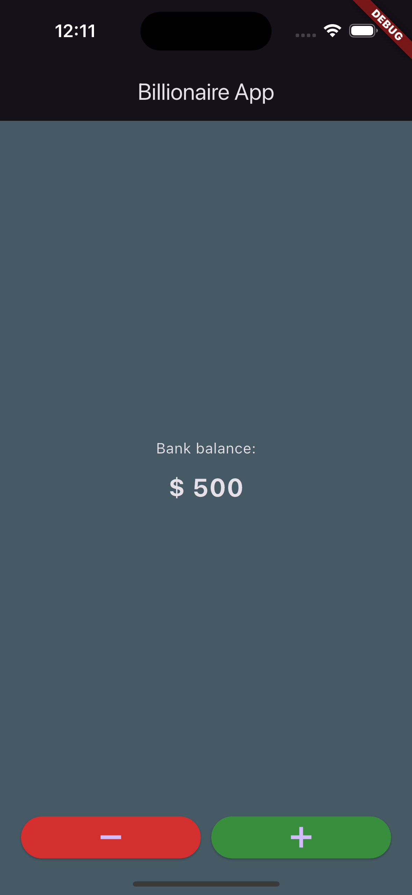

## Billionaire App

A simple Flutter app for adding and subtracting money from a virtual balance.

### Features
- **Add Money**: Increase your balance by tapping the green plus button.
- **Reduce Money**: Decrease your balance by tapping the red minus button.
- **Persistent Balance**: Your balance is saved locally and restored when you reopen the app.
- **Modern UI**: Clean, dark-themed interface with clear balance display.

### How It Works
The app starts with a default balance. You can add or subtract money in increments of 500 units. The balance is displayed in USD format. All changes are saved using local storage, so your balance persists between sessions.


### App Screenshot



### Getting Started
1. **Clone the repository:**
	```sh
	git clone <repo-url>
	cd billionaire_app
	```
2. **Install dependencies:**
	```sh
	flutter pub get
	```
3. **Run the app:**
	```sh
	flutter run
	```

### Dependencies
- [Flutter](https://flutter.dev/)
- [shared_preferences](https://pub.dev/packages/shared_preferences)
- [currency_formatter](https://pub.dev/packages/currency_formatter)

### File Structure
- `lib/main.dart`: Main app logic and UI
- `lib/components/`: UI components (balance view, add/reduce buttons)

### License
This project is licensed under the MIT License.
